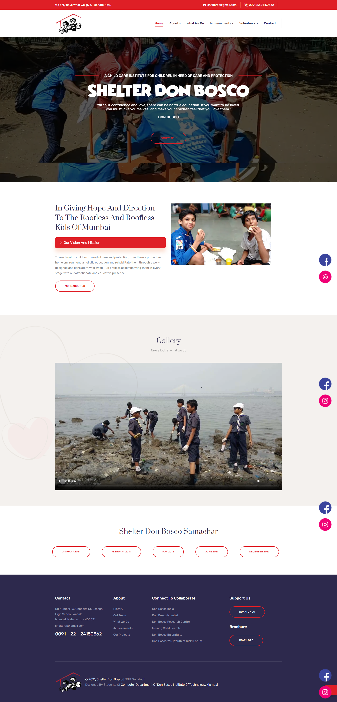

# SHELTER DON BOSCO


## Table of contents

- [Overview](#overview)
- [Screenshots](#screenshots)
- [Getting Started](#gettingstarted)
- [Contributors](#contributors)

## Overview

#### SHELTER DON BOSCO
Shelter Don Bosco is a Non Governmental Organisation working with the Roofless and Rootless Street Children of the City of Mumbai since 1987. Initiated by the Salesian Society in the Province of Mumbai, Shelter Don Bosco is a part of the Don Bosco family of institutions that work with and for youth, especially the emarginated ones.
Over the past years Shelter Don Bosco has responded to the growing needs and demands of our young friends in various ways, each of which has led to several different projects that seek to empower the marginalized child. This web site is dedicated to the unsung Heroes living on the streets of Mumbai. We welcome you to be a part of this journey of LOVE.


### Screenshots
 


## Getting Started  <a id="gettingstarted"></a>

#### Step 1:

Download or clone this repository by using the command given below:

```
git clone https://github.com/dbitsevatech/shelter-don-bosco
```

#### Step 2:

Go to project root and open the index.html file in the browser


## Contributors <a id="contributors"></a>
  - Grejo Joby'<br> 
  [](https://www.linkedin.com/in/grejojoby)
  [](https://github.com/grejojoby)
  - Hayden Cordeiro<br>
  [](https://www.linkedin.com/in/haydencordeiro/)
  [](https://github.com/haydencordeiro)
  - Shawn Louis<br>
  [](https://www.linkedin.com.in/shawnlouis)
  [](https://www.github.com/shawn1912)


